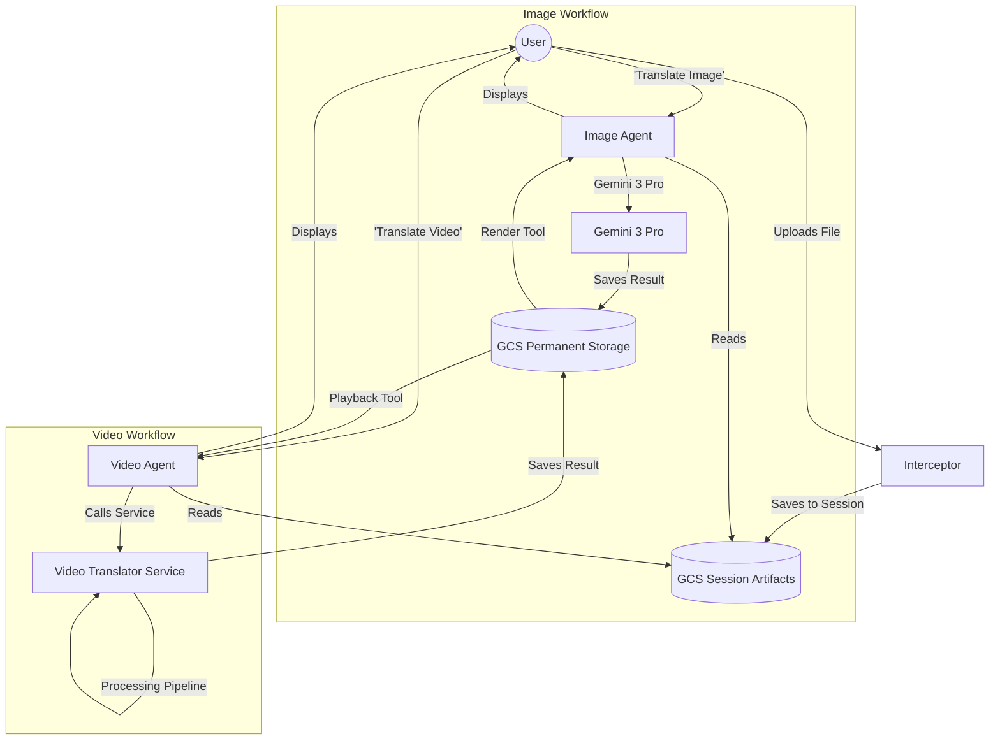
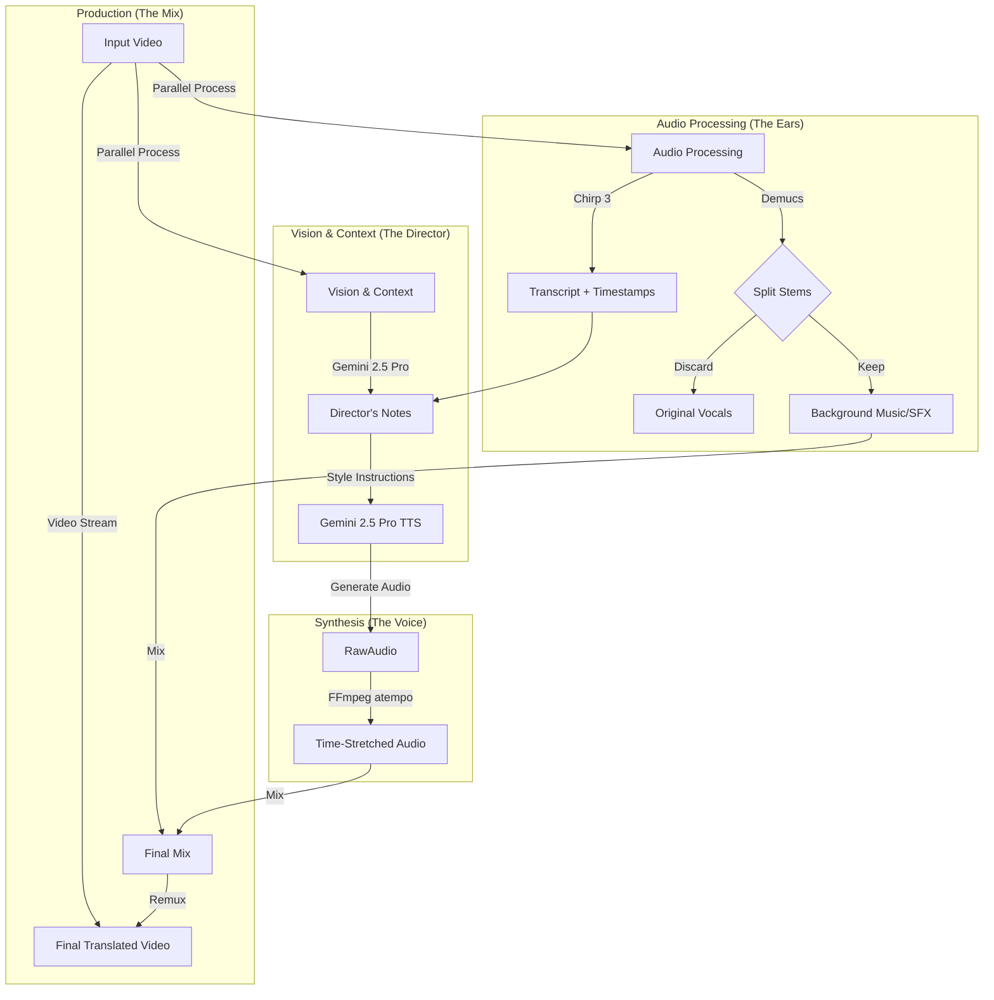
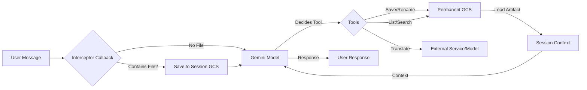

# 🎬 SpinMaster: AI Media Producer
## Expressive Video & Image Translator (2026)

Welcome to the **SpinMaster** project. This is a state-of-the-art multimodal translation system designed for high-fidelity media localization. It features two specialized AI agents and a heavy-duty backend service to perform:

1.  **Style-Preserving Image Translation:** Translates text on product images while keeping the original background, fonts, and lighting intact.
2.  **Emotional Video Dubbing:** Translates video dialogue while preserving the speaker's emotional tone ("soul"), background music, and sound effects.

---

## 🧩 Project Components

### 1. The Image Agent (`image_Agent/agent.py`)
A specialized multimodal agent built with the **Google ADK (Agent Development Kit)**.
*   **Role:** Manages high-resolution image assets.
*   **Key Features:**
    *   **Visual Sync:** Intercepts uploads to display them immediately in the chat.
    *   **Persistence:** Saves session images to a permanent Google Cloud Storage (GCS) gallery.
    *   **Translation:** Uses **Gemini 3 Pro** (`gemini-3-pro-image-preview`) for pixel-perfect text replacement on images.

### 2. The Video Agent (`video_agent/agent.py`)
A robust orchestration agent for video workflows.
*   **Role:** Manages video uploads and coordinates the translation process.
*   **Key Features:**
    *   **Large File Handling:** Intercepts video uploads and streams them to GCS.
    *   **Service Orchestration:** Sends video assets to the backend *Video Translator Service* for processing.
    *   **Discovery:** Lists and plays back videos from the cloud library.

### 3. The Video Translator Service (`video-translator-service/`)
The "Engine Room." A high-performance FastAPI service deployed on **Cloud Run (Gen 2)** with **24GiB of RAM**. It executes a 5-Phase pipeline to perform "Emotional Dubbing."

#### ⚙️ The 5-Phase Pipeline
1.  **The "Ears" (Chirp 3 STT):** Transcribes audio with word-level timestamps to know exactly when every word is spoken.
2.  **The "Director" (Gemini 2.5 Pro):** Watches the video and listens to the audio to generate "Director's Notes" (e.g., *"Speak with high-pitched excitement"*).
3.  **The "Voice" (Gemini 2.5 Pro TTS):** Generates the translated speech using the Director's Notes.
    *   *Time-Stretching:* Uses FFmpeg `atempo` to ensure the new speech fits the original video's timing perfectly.
4.  **Stem Separation (Demucs):** Uses AI to split the audio into "Vocals" and "Background." The original English vocals are discarded, but the background music/SFX are kept.
5.  **Production (FFmpeg Muxing):** Mixes the new translated voice with the original background track and remuxes it with the video for a seamless result.

---

## 🚀 Deployment

### A. Full Cloud Deployment (Recommended)
The project includes a master script to deploy all components (Cloud Run Service + Both Agents) and register them with **Gemini Enterprise**.

**Prerequisites:**
*   A Google Cloud Project with billing enabled.
*   `gcloud` CLI installed and authenticated.
*   **OAuth Credentials:** Place your `credentials.json` (Web Application type) in the `add_agent_scripts/` directory.

**Steps:**
1.  Run the deployment script:
    ```bash
    ./deploy_all.sh
    ```
2.  Follow the prompts to enter your Project ID and Gemini App ID.
3.  The script will:
    *   Enable all necessary APIs (Vertex AI, Cloud Run, Speech, etc.).
    *   Create Service Accounts and assign IAM roles.
    *   Deploy the Video Translator Service to Cloud Run.
    *   Deploy the Image and Video Agents to Vertex AI Reasoning Engine.
    *   Register both agents with your Gemini Enterprise app.

### B. Local Development (Testing Agents)
You can run the agents locally using `uv` (a fast Python package manager).

1.  **Install `uv`:**
    ```bash
    curl -LsSf https://astral.sh/uv/install.sh | sh
    ```
2.  **Run an Agent:**
    ```bash
    # For Image Agent
    export GOOGLE_CLOUD_PROJECT="your-project-id"
    export GCS_ARTIFACTS_BUCKET="your-bucket-name"
    uv run adk web run image_Agent/agent.py

    # For Video Agent
    export VIDEO_SERVICE_URL="https://your-cloud-run-url.a.run.app"
    uv run adk web run video_agent/agent.py
    ```

### C. Clean Up (Rollback)
To delete all deployed resources (Cloud Run service, Agents, Service Accounts):
```bash
./rollback_all.sh
```

---

## 📐 Architecture Diagrams

### High-Level User Flow



### Video Translator Service Pipeline (Internal)



### Agent Architecture (Common Pattern)



---

## 🛠 Required Google Cloud Services

*   **Cloud Run:** Hosting the video processing service.
*   **Vertex AI (Reasoning Engine):** Hosting the agents.
*   **Vertex AI (Gemini):** Powering the LLM logic (Gemini 2.5 Pro, Gemini 3 Pro).
*   **Speech-to-Text V2:** For Chirp 3 transcription.
*   **Text-to-Speech:** For Gemini 2.5 Pro TTS.
*   **Cloud Storage:** For storing media assets.
*   **Discovery Engine:** For registering agents with Gemini Enterprise.
