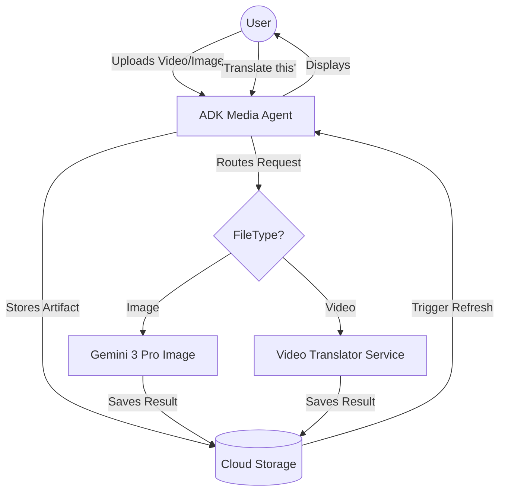
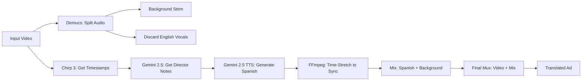

# 🎬 AI Media Producer: Expressive Video & Image Translator

Welcome to the **AI Media Producer** project. This is a state-of-the-art multimodal translation system designed for 2026. It can translate product images while preserving aesthetics and perform high-fidelity video dubbing that captures the original speaker's emotional "soul" while keeping the original background music and sound effects.

---

## Workflow

### Image workflow

  - User uploads image and it is immediately intercepted by plugin: SaveFilesAsArtifactsPlugin
  - User asks to list files
  - User then asks to rename the file they just uploaded to a name they choose
  - User then asks to translate the renamed image to a certain language
  - The agent saves the new image using preformatted naming convention and return it to the user

## 🧩 Project Components

### 1. The Media Agent (`agent.py`)

The "Brain" of the operation. Built using the **Google ADK (Agent Development Kit)**, this agent interacts with the user via a web interface.

* **File Management:** Saves uploads and lists session artifacts in Google Cloud Storage (GCS).
* **Routing:** Detects user intent. It routes image translation tasks directly to the Gemini 3 Pro model and video translation tasks to the dedicated Cloud Run service.
* **UI Synchronization:** Triggers automatic display updates so the user sees translated media immediately in the UI.

### 2. The Video Tool (`vid_to_bytes.py`)

The "Bridge." This is an asynchronous Python tool used by the agent to stream large video files as raw bytes to the Cloud Run service. It handles the high-timeout HTTP requests required for complex AI audio processing.

### 3. The Video Translator Service (`main.py` on Cloud Run)

The "Engine Room." A high-performance FastAPI service deployed on **Cloud Run (Gen 2)** with **24GiB of RAM**. It orchestrates a 5-Phase pipeline to perform "Emotional Dubbing."

---

## ⚙️ How the Video Translator Service Works

The service follows a sophisticated pipeline to ensure the translated audio is perfectly synced and emotionally identical to the source.

### Phase 1: The "Ears" (Chirp 3 STT)

The service uses **Chirp 3**, Google’s most advanced Speech-to-Text model. It transcribes the English audio and, most importantly, provides **word-level timestamps**. This tells the service exactly which millisecond every word starts and ends.

### Phase 2: The "Director" (Gemini 2.5 Pro Multimodal)

The video is sent to **Gemini 2.5 Pro**. The model "watches" the video and "listens" to the English narrator. It generates a **Director’s Note** for every segment (e.g., *"Speak with high-pitched excitement and a vocal smile"*).

### Phase 3: The "Voice" (Gemini 2.5 Pro TTS)

The English text is sent to **Gemini 2.5 Pro TTS**. Using the Director's Note from Phase 2, the model generates a Spanish (or other language) version.

* **Time-Alignment:** If the Spanish translation is longer than the English original, the service applies an **FFmpeg `atempo` filter** to speed up the voice without changing the pitch, ensuring it fits the video perfectly.

### Phase 4: Stem Separation (Demucs)

To keep the background noise (music, crowds, car engines), the service uses **Demucs (AI Source Separation)**.

* It splits the original audio into two "Stems": **Vocals** and **No Vocals**.
* The original English **Vocals** are discarded.
* The original **No Vocals** (Background) is kept.

### Phase 5: Production (FFmpeg Muxing)

The service uses **FFmpeg** to mix the new Spanish voice stem with the original background stem. It then performs a **Hard Swap**, mapping the original video pixels to the new audio mix, resulting in a clean, professional Ad with zero English bleed-through.

---

## 🛠 Required Google Cloud Services & APIs

You must enable the following APIs in your Google Cloud Project:

1. **Cloud Run:** To host the heavy-duty processing service.
2. **Vertex AI API:** To power Gemini 2.5 Pro and Gemini 3 Pro.
3. **Speech-to-Text V2 API:** For the Chirp 3 model.
4. **Text-to-Speech API:** For the Gemini 2.5 Pro TTS engine.
5. **Cloud Translation API:** For text-to-text translation.
6. **Cloud Storage:** For session artifact and debug storage.

---

## 🔐 Required IAM Roles

The Service Account associated with the Cloud Run instance requires the following permissions:

| Role | Purpose |
| :--- | :--- |
| `roles/speech.admin` | Full access to Chirp 3 and Recognizers. |
| `roles/aiplatform.user` | To call Gemini 2.5 Pro Multimodal and Analysis. |
| `roles/texttospeech.user` | To call the Gemini 2.5 Pro TTS model. |
| `roles/cloudtranslate.user` | To perform text translations. |
| `roles/storage.objectAdmin` | To read/write video files and debug audio in GCS. |

---

## 📐 Architecture Diagrams

### High-Level User Flow



### Video Translator Internal Pipeline



---

## 🚀 Deployment

1. **Deploy the Service:** Run `./deploy.sh` in the video service directory. This allocates 24Gi RAM and 8 CPUs.
2. **Run the Agent:**
3.  

```bash
    export VIDEO_SERVICE_URL="https://your-service-url.a.run.app"
    adk web run agent.py --artifact_service_uri='gs://your-project-storage'
```

---

### 💡 Why FFmpeg & Demucs?

* **Demucs** is critical because standard "ducking" often leaves the original narrator's voice audible in the background. Demucs uses deep learning to "unbake" the audio, allowing us to delete the English speaker entirely while leaving the music untouched.
* **FFmpeg** is the orchestration engine for the audio. It handles the `adelay` (offsetting speech), `atempo` (matching speech duration), and the final `map` (swapping audio tracks) with mathematical precision.

---

## 🚀 Getting Started (Using `uv`)

This project uses [**uv**](https://docs.astral.sh/uv/), the extremely fast Python package manager. Follow these steps to clone and run the project in your local environment.

### 1. Install `uv`

If you don't have `uv` installed, run:

```bash
curl -LsSf https://astral.sh/uv/install.sh | sh
```

### 2. Clone the Project

```bash
git clone <your-repo-url>
cd video-translator-project
```

### 3. Synchronize the Environment

`uv` will automatically detect the `pyproject.toml` file, create a virtual environment, and install all dependencies (including the heavy **Torch** and **Demucs** libraries) with high speed.

```bash
uv sync
```

### 4. Set Environment Variables

Create a `.env` file or export the following:

```bash
export GOOGLE_CLOUD_PROJECT="your-project-id"
export BUCKET_NAME="your-gcs-bucket-name"
export VIDEO_SERVICE_URL="https://your-cloud-run-url.a.run.app"
```

### 5. Run the Agent

To start the ADK Web UI and point it to your storage bucket:

```bash
uv run adk web run agent.py --artifact_service_uri="gs://${BUCKET_NAME}"
```

---
