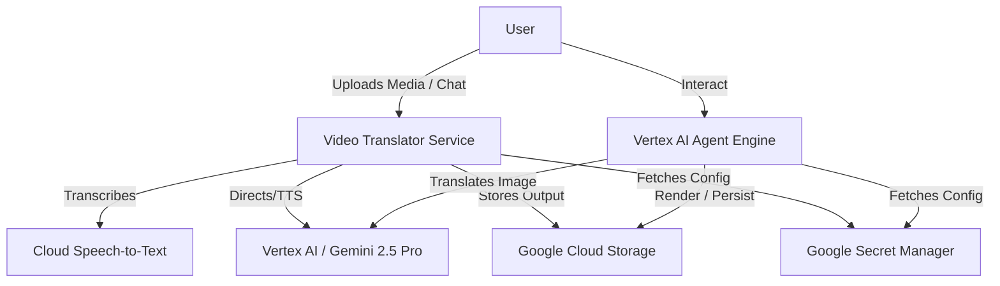

# Spinmaster AI Multimodal Application

## Solution Overview
The Spinmaster AI application is a production-grade, multimodal system designed to orchestrate complex video and image processing tasks. It leverages advanced Large Language Models (LLMs) and specialized Google Cloud infrastructure to offer an intelligent video translator service and context-aware multimodal agents (Image and Video). The solution processes user uploads, extracts features, performs sentiment and semantic analysis, and applies style-preserving AI translation to multimedia assets.

## Architecture Diagram



## Core System Features

*   **Evaluation:** The system features a holistic Agent Development Kit (ADK) evaluation framework. Programmatic test suites utilize `AgentEvaluator.evaluate()` to systematically validate agent trajectories, semantic response matching, and hallucination reduction against baseline scenarios.
*   **CI/CD:** The repository features an automated continuous integration and continuous deployment pipeline orchestrated exclusively via Google Cloud Build. Commits to the main branch trigger unit testing, ADK evaluations, container builds, and infrastructure deployments. Ensure no GitLab CI or other unsupported frameworks exist.
*   **OAuth 2.0:** The architecture employs OAuth 2.0 authentication flows for secure inter-service communication and agent registration, utilizing Google Cloud tokens and workload identity where applicable.
*   **Security:** The application enforces a stringent security posture. Sensitive credentials and configurations are exclusively managed and accessed via Google Secret Manager. All Google Cloud IAM service accounts adhere strictly to the principle of least privilege, scoped meticulously via Terraform to exact resource requirements.
*   **Unit Testing:** The codebase incorporates a comprehensive unit testing framework utilizing Pytest. Core logic and API endpoints are systematically tested to ensure behavioral correctness and stability prior to deployment.
*   **Autoscaling & Workload Configuration:** The cloud infrastructure, managed via Terraform, inherently scales based on demand. The compute environments running the stateless video translator service automatically adjust capacity. Specifically, the Cloud Run workload is configured with a minimum active instance count (`min_instances = 1`) to prevent cold starts, and utilizes a minimum memory allocation of 8Gi to accommodate heavy compute requirements such as Demucs audio separation and FFmpeg processing.
*   **Terraform:** The entire infrastructure lifecycle is managed predictably using Infrastructure as Code via Terraform. It ensures reproducible, automated provisioning of compute instances, storage, identity, and API enablement.

## Deployment & Operations

**Running Local Tests**
```bash
# Run backend translator tests
cd video-translator-service
pip install -r requirements.txt
pytest test_main.py

# Run ADK agent evaluations
cd image_Agent
pytest test_image_agent_eval.py

cd ../video_agent
pytest test_video_agent_eval.py
```

**Automated Deployment**
Deployment is entirely handled via Google Cloud Build.
1. Push changes to the repository.
2. Cloud Build executes `cloudbuild.yaml`.
3. The pipeline runs all evaluations and tests.
4. It builds and pushes Docker artifacts to Artifact Registry.
5. `terraform apply` provisions necessary infrastructure and IAM policies.
6. The updated service is deployed to Google Cloud Run.

## Generative AI & Models

The application inherently functions as a comprehensive GenMedia solution. It automates the complex, multi-step process of localizing and adapting multimedia advertisements by intelligently separating audio stems, transcribing dialogue, analyzing sentiment to direct voice actors, synthesizing new high-fidelity voices, and visually translating product imagery. This provides immense specific benefits to the media and entertainment industry by drastically reducing the time and cost associated with international campaign distribution, enabling rapid, culturally nuanced global outreach without the need for extensive re-shooting or manual studio dubbing.

The solution integrates the following specific models:
*   **Gemini 2.5 Flash:** Operates as the foundational reasoning engine for both the `image_agent` and `video_agent` orchestration layers, managing user interactions and tool execution.
*   **Gemini 2.5 Pro:** Utilized by the video translator service for nuanced "Voice-Over Director" sentiment analysis, analyzing video segments to produce emotional styling notes.
*   **Gemini 2.5 Pro TTS (Aoede Voice):** Deployed for high-impact text-to-speech synthesis, dynamically adjusting tone based on the director's notes to produce the localized voiceover track.
*   **Gemini 3 Pro Image Preview:** Implemented for high-fidelity, style-preserving image-to-image translation, specifically replacing text on product labels while maintaining the original visual aesthetic.
*   **Chirp 3 (Cloud Speech-to-Text):** Serves as the robust audio transcription model ("The Ears"), extracting English dialogue with precise word-level timestamps.
*   **HTDemucs (via Demucs):** Utilized for audio stem separation, successfully isolating vocal tracks from ambient noise and background music.